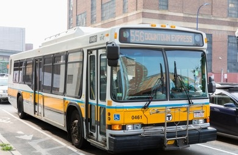

# Real-Time-Bus-Tracker
Real-Time Bus Tracker

Real-Time Bus Tracker project
This is an exercise developed during MIT xPro Professional Certificate in Coding: Full Stack Development with MERN. It's about using the MBTA bus data to determine stops between Harvard and MIT. I added an animated marker on the map to highlight the bus routes

## Installation 🔧

To install this project in your machine, follow these steps:

1. Download or clone the project
2. Go to content folder and add it to your code editor tool
3. Go to MapBox and get an API Token, in mapanimation.js fille, replace mapboxgl.accessToken = "THIS VALUE"; with your own API token
4. Open index.html

## Run 🚀
1. When the map is loaded, you should be able to see a marker moving from one bus stop to the next on the map

## Roadmap 🗺

1. Responsive support
2. When there is no bus in transit show an alert

